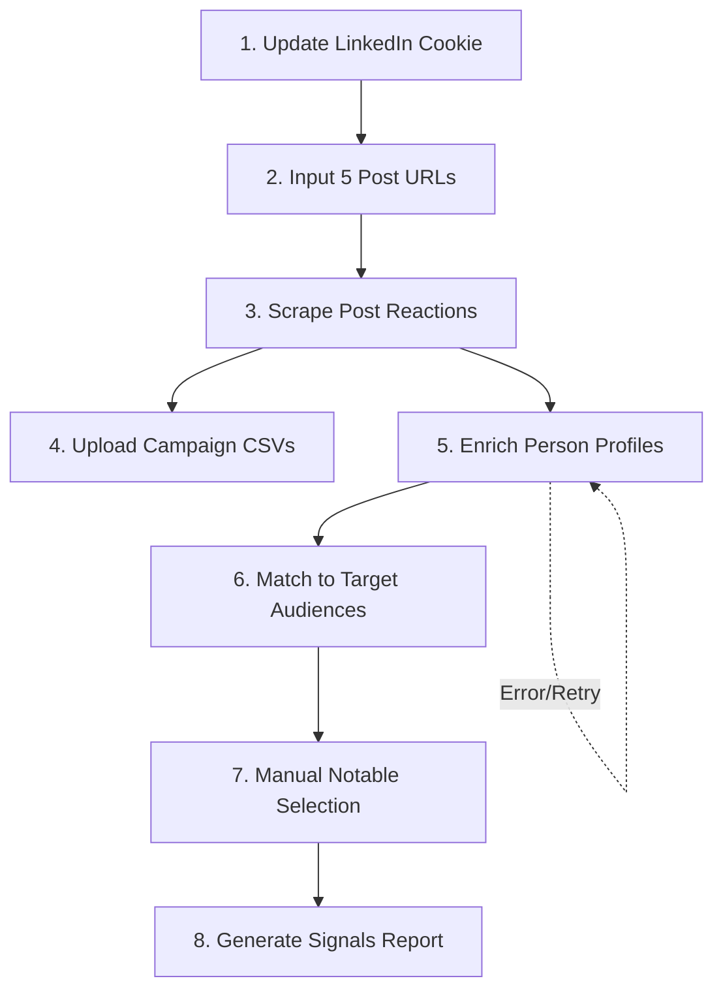

# Comprehensive LinkedIn Campaign Intelligence Workflow Implementation

## Executive Summary

This implementation plan transforms your LinkedIn campaign tracking into a sophisticated intelligence operation with automated scraping, enrichment, deduplication, and report generation. The workflow supports tracking 5+ posts, each with 0-5 campaigns, automatic profile enrichment with retry logic, and manual notable selection for curated reporting.

## Core Workflow Overview



## 🔧 Implementation Components

### 1. Cookie Management System

**Backend Updates** (`backend/cookie_manager.py`):
```python
class CookieManager:
    def __init__(self, supabase_client):
        self.supabase = supabase_client
        
    def update_cookie(self, new_cookie: str) -> bool:
        """Update LinkedIn cookie with validation"""
        # Validate cookie format
        if not self._validate_cookie(new_cookie):
            return False
            
        # Store encrypted in database
        encrypted = self._encrypt_cookie(new_cookie)
        self.supabase.table('linkedin_cookies').upsert({
            'id': 'primary',
            'encrypted_cookie': encrypted,
            'updated_at': datetime.now().isoformat(),
            'is_active': True
        }).execute()
        
        return True
```

**Frontend Updates**:
- Add cookie update modal in settings
- Show last updated date
- Alert when cookie is > 7 days old

### 2. Bulk Post Tracking Interface

**New API Endpoint** (`POST /api/posts/bulk-track`):
```python
@app.post("/api/posts/bulk-track")
async def bulk_track_posts(request: Request):
    data = await request.json()
    post_urls = data.get('urls', [])
    
    tracked_posts = []
    for url in post_urls[:5]:  # Limit to 5 posts
        result = await tracker.track_post_engagement(url)
        tracked_posts.append(result)
    
    return {
        "success": True,
        "posts": tracked_posts,
        "message": f"Started tracking {len(tracked_posts)} posts"
    }
```

**Frontend Bulk Input Component**:
```javascript
// New bulk post input interface
bulkPostInput: {
    urls: ['', '', '', '', ''],
    isTracking: false,
    
    async trackAllPosts() {
        const validUrls = this.urls.filter(url => url.trim());
        const response = await fetch('/api/posts/bulk-track', {
            method: 'POST',
            body: JSON.stringify({ urls: validUrls })
        });
        // Handle response
    }
}
```

### 3. Enhanced Profile Enrichment with Retry Logic

**Backend Enrichment Service** (`backend/enrichment_service.py`):
```python
class ProfileEnrichmentService:
    MAX_RETRIES = 3
    RETRY_DELAY = 300  # 5 minutes
    
    async def enrich_profiles_from_post(self, post_id: int):
        """Enrich all profiles from a post with automatic retry"""
        # Get unique persons who engaged
        persons = self._get_unenriched_persons(post_id)
        
        for person in persons:
            await self._enrich_with_retry(person)
    
    async def _enrich_with_retry(self, person):
        """Enrich profile with exponential backoff retry"""
        for attempt in range(self.MAX_RETRIES):
            try:
                job = await self._start_enrichment_job(person)
                await self._monitor_job(job)
                break
            except ApifyJobError as e:
                if attempt < self.MAX_RETRIES - 1:
                    delay = self.RETRY_DELAY * (2 ** attempt)
                    await asyncio.sleep(delay)
                else:
                    # Log failed enrichment for manual review
                    self._log_enrichment_failure(person, str(e))
```

**Job Monitoring System**:
```python
class JobMonitor:
    def __init__(self):
        self.active_jobs = {}
        
    async def monitor_enrichment_jobs(self):
        """Continuous monitoring of enrichment jobs"""
        while True:
            failed_jobs = await self._check_job_statuses()
            
            for job_id in failed_jobs:
                # Automatic retry
                await self._retry_failed_job(job_id)
                
            await asyncio.sleep(60)  # Check every minute
```

### 4. Audience Definition & Matching

**Database Schema Addition**:
```sql
-- Target audiences with detailed criteria
CREATE TABLE target_audiences (
    id SERIAL PRIMARY KEY,
    name TEXT NOT NULL,
    companies JSONB DEFAULT '[]',  -- Array of company names
    job_titles JSONB DEFAULT '[]',  -- Array of job titles
    seniority_levels JSONB DEFAULT '[]',
    created_at TIMESTAMPTZ DEFAULT NOW()
);

-- Link audiences to campaigns
ALTER TABLE campaigns 
ADD COLUMN target_audience_id INTEGER REFERENCES target_audiences(id);
```

**Matching Algorithm** (`backend/audience_matcher.py`):
```python
class AudienceMatcher:
    def match_person_to_audience(self, person: dict, audience: dict) -> float:
        """Calculate match score (0-1) for person against audience"""
        score = 0.0
        weights = {
            'company': 0.4,
            'title': 0.4,
            'seniority': 0.2
        }
        
        # Company match
        if person.get('current_company') in audience.get('companies', []):
            score += weights['company']
            
        # Title match (fuzzy)
        title_score = self._fuzzy_title_match(
            person.get('current_title'), 
            audience.get('job_titles', [])
        )
        score += title_score * weights['title']
        
        # Seniority match
        if person.get('seniority') in audience.get('seniority_levels', []):
            score += weights['seniority']
            
        return score
```

### 5. Notable Selection Interface

**Database Update**:
```sql
-- Add notable tracking
ALTER TABLE persons 
ADD COLUMN is_notable BOOLEAN DEFAULT FALSE,
ADD COLUMN notable_tier INTEGER,  -- 1, 2, 3
ADD COLUMN notable_reason TEXT,
ADD COLUMN notable_marked_at TIMESTAMPTZ,
ADD COLUMN notable_marked_by TEXT;
```

**Frontend Notable Selection UI**:
```html
<!-- In person list view -->
<div class="notable-selection">
    <input type="checkbox" 
           x-model="person.is_notable"
           @change="markNotable(person)">
    
    <select x-show="person.is_notable"
            x-model="person.notable_tier"
            @change="updateNotableTier(person)">
        <option value="1">Tier 1 - Top Priority</option>
        <option value="2">Tier 2 - Important</option>
        <option value="3">Tier 3 - Interesting</option>
    </select>
    
    <input x-show="person.is_notable"
           x-model="person.notable_reason"
           placeholder="Why notable?"
           @blur="saveNotableReason(person)">
</div>
```

### 6. Signals Dashboard & Report Generation

**Report API Endpoint** (`GET /api/campaigns/{id}/signals-report`):
```python
@app.get("/api/campaigns/{campaign_id}/signals-report")
async def get_signals_report(campaign_id: int):
    """Generate comprehensive signals report"""
    
    # Get campaign data
    campaign = await get_campaign_with_audience(campaign_id)
    
    # Get all engagements
    engagements = await get_campaign_engagements(campaign_id)
    
    # Separate by audience match
    in_audience = []
    out_of_audience = []
    
    for eng in engagements:
        match_score = matcher.match_person_to_audience(
            eng['person'], 
            campaign['target_audience']
        )
        
        if match_score > 0.5:
            in_audience.append(eng)
        else:
            out_of_audience.append(eng)
    
    # Get notables
    tier1_notables = [p for p in engagements if p.get('notable_tier') == 1]
    tier2_notables = [p for p in engagements if p.get('notable_tier') == 2]
    
    return {
        "campaign": campaign,
        "metrics": {
            "total_engagements": len(engagements),
            "in_audience_count": len(in_audience),
            "out_of_audience_count": len(out_of_audience),
            "match_rate": (len(in_audience) / len(engagements) * 100) if engagements else 0
        },
        "notables": {
            "tier1": tier1_notables[:5],  # Top 5
            "tier2": tier2_notables[:15],  # Next 15
            "outliers": identify_interesting_outliers(out_of_audience)
        },
        "audience_breakdown": {
            "by_company": group_by_company(in_audience),
            "by_title": group_by_title(in_audience),
            "by_seniority": group_by_seniority(in_audience)
        }
    }
```

**Frontend Signals Dashboard**:
```javascript
// New signals view component
signalsView: {
    async loadSignalsReport(campaignId) {
        const response = await fetch(`/api/campaigns/${campaignId}/signals-report`);
        this.report = await response.json();
        
        // Render interactive dashboard
        this.renderMatchRateChart();
        this.renderAudienceBreakdown();
        this.renderNotablesList();
    }
}
```

## 🚦 Workflow Automation Scripts

### Master Workflow Orchestrator (`backend/workflow_orchestrator.py`):
```python
class WorkflowOrchestrator:
    def __init__(self):
        self.enrichment_service = ProfileEnrichmentService()
        self.job_monitor = JobMonitor()
        
    async def execute_full_workflow(self, post_urls: List[str]):
        """Execute complete workflow for multiple posts"""
        
        # 1. Track all posts
        posts = await self.bulk_track_posts(post_urls)
        
        # 2. Start enrichment jobs
        for post in posts:
            asyncio.create_task(
                self.enrichment_service.enrich_profiles_from_post(post['id'])
            )
        
        # 3. Monitor enrichment progress
        asyncio.create_task(self.job_monitor.monitor_enrichment_jobs())
        
        return {
            "posts": posts,
            "enrichment_status": "started",
            "monitor_url": "/api/enrichment-status"
        }
```

## 🔐 Data Deduplication Strategy

### Person Deduplication:
```python
def deduplicate_person(person_data: dict) -> int:
    """Find or create person with deduplication"""
    
    # Primary key: LinkedIn URL
    existing = supabase.table('persons').select('*').eq(
        'linkedin_url', person_data['linkedin_url']
    ).execute()
    
    if existing.data:
        # Update with new data (merge)
        person_id = existing.data[0]['id']
        merged_data = merge_person_data(existing.data[0], person_data)
        supabase.table('persons').update(merged_data).eq('id', person_id).execute()
    else:
        # Create new
        result = supabase.table('persons').insert(person_data).execute()
        person_id = result.data[0]['id']
    
    return person_id
```

### JSONB Storage for Variable Experience:
```sql
-- Store variable-length experience data
ALTER TABLE persons 
ADD COLUMN experience_data JSONB DEFAULT '[]',
ADD COLUMN skills_data JSONB DEFAULT '[]',
ADD COLUMN education_data JSONB DEFAULT '[]';
```

## 📊 Key UI/UX Improvements

### 1. Workflow Progress Dashboard
- Real-time status of all scraping jobs
- Enrichment progress bar
- Error alerts with retry options

### 2. Audience Builder Interface
- Visual company/title selector
- Import from LinkedIn Campaign Manager
- Save/load audience templates

### 3. Notable Selection Workflow
- Keyboard shortcuts (1, 2, 3 for tiers)
- Bulk selection tools
- Smart suggestions based on patterns

### 4. Export Options
- PDF signals report
- CSV export with all enriched data
- Shareable dashboard links

## 🚀 Implementation Priority

1. **Week 1**: Cookie management + Bulk post tracking
2. **Week 2**: Enhanced enrichment with retry logic
3. **Week 3**: Audience matching + Notable selection
4. **Week 4**: Signals dashboard + Report generation

## 📝 Next Steps

1. **Update LinkedIn Cookie** - Add your fresh cookie to the .env file
2. **Test Bulk Tracking** - Try tracking 2-3 posts initially
3. **Define Target Audiences** - Create your first audience criteria
4. **Run Full Workflow** - Execute complete flow on sample campaign

This implementation maintains simplicity while providing the sophisticated workflow you need for LinkedIn campaign intelligence.