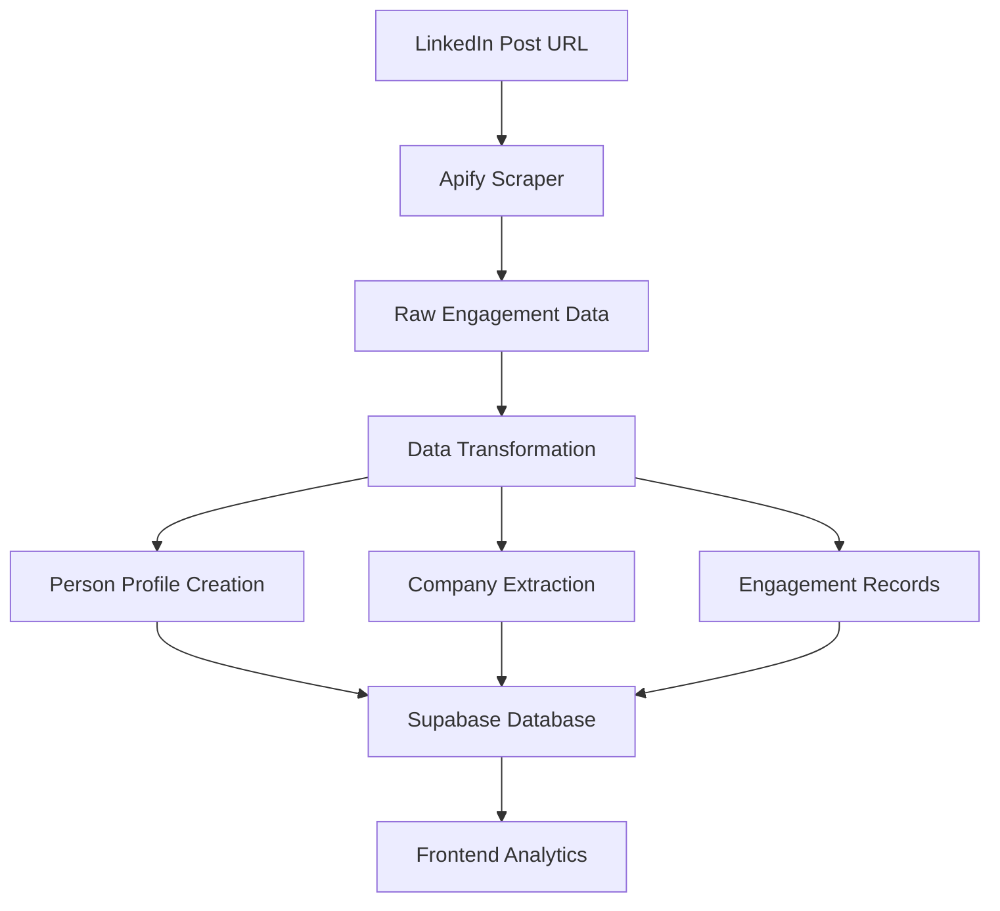

# API Integrations Guide

## 🔌 Overview

**Signals & Actions** integrates with three primary APIs to provide comprehensive LinkedIn engagement analytics:

1. **LinkedIn Marketing API** - Campaign data, targeting, analytics
2. **Apify LinkedIn Scraper** - Post engagement data collection
3. **Supabase** - Database operations and real-time features

## 📱 LinkedIn Marketing API Integration

### Architecture
```
Frontend ──► Express.js Proxy ──► LinkedIn Marketing API
                                        │
                                        ▼
                                 Campaign Data
                                 Audience Data
                                 Analytics Data
```

### Proxy Server Setup
**Location**: `/api-proxy/server.js`

```javascript
// LinkedIn API Configuration
const LINKEDIN_CONFIG = {
    baseUrl: 'https://api.linkedin.com/rest',
    version: '202501',
    accessToken: process.env.LINKEDIN_ACCESS_TOKEN
};
```

### Available Endpoints

#### 1. Connection Test
```javascript
GET /api/linkedin/test
// Returns: Connection status and account count
```

#### 2. Ad Accounts
```javascript
GET /api/linkedin/accounts
// Returns: List of accessible ad accounts
```

#### 3. Campaigns
```javascript
GET /api/linkedin/accounts/:accountId/campaigns
// Returns: Campaigns for specific account
```

#### 4. Campaign Analytics
```javascript
GET /api/linkedin/proxy/adAnalytics?campaigns=List(urn:li:sponsoredCampaign:123)
// Returns: Detailed campaign performance metrics
```

### Authentication
- **Method**: OAuth 2.0 Bearer Token
- **Storage**: Environment variable `LINKEDIN_ACCESS_TOKEN`
- **Refresh**: Manual token refresh (automation planned)

### Rate Limiting
- **Limit**: 500 requests per hour
- **Implementation**: Client-side tracking with cache
- **Cache Duration**: 5 minutes for GET requests

### Error Handling
```javascript
// Standardized error response
{
    "success": false,
    "message": "Rate limit exceeded",
    "details": { /* LinkedIn error details */ }
}
```

## 🕷️ Apify LinkedIn Scraper Integration

### Actor Details
- **Actor ID**: `curious_coder/linkedin-post-reactions-scraper`
- **Purpose**: Extract engagement data from LinkedIn posts
- **Rate Limits**: Managed by Apify platform

### API Configuration
```javascript
const APIFY_CONFIG = {
    token: 'YOUR_APIFY_API_TOKEN',
    actorId: 'curious_coder/linkedin-post-reactions-scraper'
};
```

### Data Collection Workflow

#### 1. Start Scraping Job
```javascript
const runInput = {
    "postUrls": ["https://www.linkedin.com/posts/..."],
    "maxResults": 1000,
    "proxy": { "useApifyProxy": true }
};

const run = await apify.actor(ACTOR_ID).call(runInput);
```

#### 2. Monitor Job Progress
```javascript
// Poll for completion
const runStatus = await apify.run(runId).get();
// Status: READY, RUNNING, SUCCEEDED, FAILED
```

#### 3. Fetch Results
```javascript
const dataset = await apify.dataset(run.defaultDatasetId).listItems();
// Returns array of engagement records
```

### Data Structure
Each engagement record contains:
```javascript
{
    "postUrl": "https://linkedin.com/posts/...",
    "personName": "John Doe",
    "personLinkedInUrl": "https://linkedin.com/in/johndoe",
    "personTitle": "Software Engineer",
    "personCompany": "Tech Corp",
    "personLocation": "San Francisco, CA",
    "reactionType": "like", // like, celebrate, support, love, insightful, curious
    "engagementType": "reaction", // reaction, comment, share
    "engagedAt": "2025-01-09T15:30:00.000Z"
}
```

### Error Handling
- **Failed Runs**: Retry mechanism with exponential backoff
- **Partial Data**: Process successful records, log failures
- **Rate Limits**: Respect Apify platform limitations

## 🗄️ Supabase Integration

### Configuration
```javascript
const SUPABASE_CONFIG = {
    url: 'https://misuahtcociqkmkajvrw.supabase.co',
    anonKey: 'YOUR_SUPABASE_SERVICE_ROLE_KEY'
};
```

### Client Initialization
```javascript
const supabaseClient = window.supabase.createClient(
    SUPABASE_CONFIG.url, 
    SUPABASE_CONFIG.anonKey
);
```

### Core Operations

#### 1. Data Import
```javascript
// Bulk insert engagements
const { data, error } = await supabaseClient
    .from('engagements')
    .insert(engagementRecords);
```

#### 2. Real-time Queries
```javascript
// Get people with filtering
const { data: people, error } = await supabaseClient
    .from('persons')
    .select('*')
    .eq('tenant_id', DEFAULT_TENANT_ID)
    .order('engagement_score', { ascending: false });
```

#### 3. Complex Analytics
```javascript
// Company aggregation
const { data: companies, error } = await supabaseClient
    .from('companies')
    .select(`
        *,
        persons:persons!company_id(count),
        total_engagements:persons!company_id.engagements(count)
    `)
    .eq('tenant_id', DEFAULT_TENANT_ID);
```

### Authentication & Security
- **Service Role**: Full database access for server operations
- **Row Level Security**: Tenant isolation (planned)
- **API Keys**: Stored in config.js (excluded from Git)

## 🔄 Data Flow Integration

### Complete Import Workflow


### Error Recovery
1. **Apify Failures**: Retry with different proxy settings
2. **Database Errors**: Batch operations with transaction rollback
3. **Network Issues**: Exponential backoff with circuit breaker

## ⚙️ Configuration Management

### Environment Variables
```bash
# API Proxy Server
LINKEDIN_ACCESS_TOKEN=AQUoVOzZPPdrbDwIditmh...
LINKEDIN_REFRESH_TOKEN=AQWxF7fPY8D8_nN2b...
PORT=3001

# Frontend (config.js)
SUPABASE_URL=https://misuahtcociqkmkajvrw.supabase.co
SUPABASE_ANON_KEY=your_service_role_key
APIFY_TOKEN=your_apify_token
DEFAULT_TENANT_ID=00000000-0000-0000-0000-000000000001
```

### Security Best Practices
- **Git Exclusion**: All API keys in .gitignore
- **Environment Separation**: Different keys for dev/prod
- **Token Rotation**: Regular refresh of LinkedIn tokens
- **CORS Restrictions**: Frontend limited to localhost

## 🚨 Monitoring & Debugging

### LinkedIn API Monitoring
```javascript
// Rate limit tracking
const rateLimitStatus = {
    requests: linkedInClient.rateLimiter.requests,
    resetTime: linkedInClient.rateLimiter.resetTime,
    remaining: 500 - linkedInClient.rateLimiter.requests
};
```

### Apify Job Monitoring
```javascript
// Check run status
const runStats = await apify.run(runId).get();
console.log(`Status: ${runStats.status}`);
console.log(`Records: ${runStats.stats.itemCount}`);
console.log(`Duration: ${runStats.finishedAt - runStats.startedAt}ms`);
```

### Database Health Checks
```javascript
// Connection test
const { data, error } = await supabaseClient
    .from('tenants')
    .select('count')
    .single();

if (error) {
    console.error('Database connection failed:', error);
}
```

## 🔮 Future Enhancements

### LinkedIn API
- **OAuth Refresh**: Automated token refresh workflow
- **Webhooks**: Real-time campaign update notifications
- **Batch Operations**: Parallel campaign data fetching

### Apify Integration
- **Profile Enrichment**: Additional actor for detailed profile data
- **Company Data**: Actor for company information scraping
- **Automated Scheduling**: Regular scraping jobs

### Supabase Optimization
- **Row Level Security**: Multi-tenant data isolation
- **Real-time Subscriptions**: Live dashboard updates
- **Edge Functions**: Server-side data processing

## 📞 API Endpoints Reference

### LinkedIn Proxy Server (Port 3001)
```
GET  /health                                    # Server status
GET  /api/linkedin/test                         # Connection test
GET  /api/linkedin/accounts                     # Ad accounts
GET  /api/linkedin/accounts/:id/campaigns       # Account campaigns
GET  /api/linkedin/accounts/:id/campaign-groups # Campaign groups
GET  /api/linkedin/targeting/facets            # Targeting options
POST /api/linkedin/audienceCounts              # Audience size estimation
ALL  /api/linkedin/proxy/*                     # Generic proxy
```

### Apify API (via JavaScript SDK)
```
POST /v2/acts/{actorId}/runs                   # Start scraping job
GET  /v2/acts/{actorId}/runs/{runId}          # Get run status
GET  /v2/datasets/{datasetId}/items           # Fetch results
```

### Supabase (via JavaScript Client)
```
# All standard REST operations on tables:
# persons, posts, companies, engagements, campaigns, audience_segments
```

This integration architecture provides a robust foundation for collecting, processing, and analyzing LinkedIn engagement data while maintaining security and performance standards.